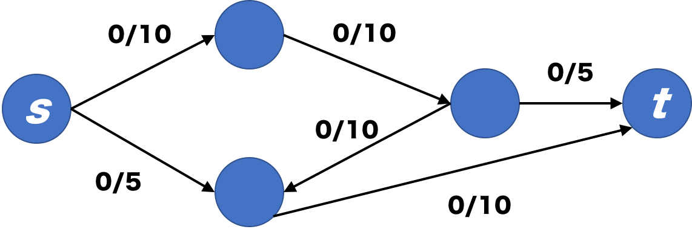
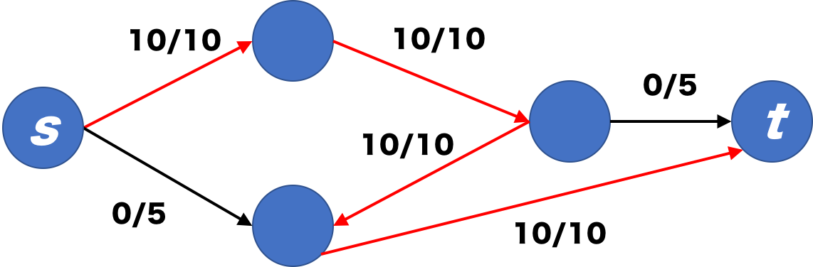
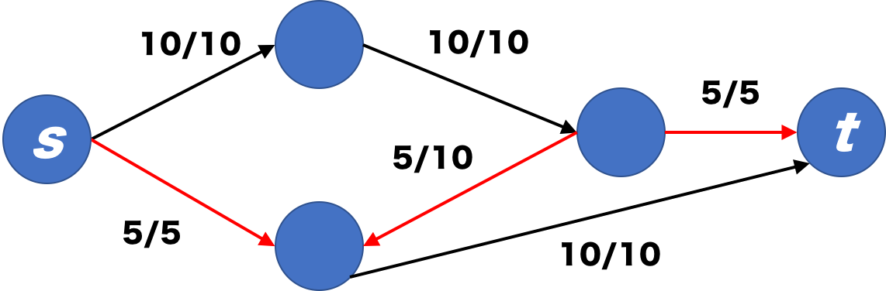

# Min-cut Max-flow Theorem

## グラフ, 重み付きグラフ

+ グラフは $G = (V, E)$ で定義されて
+ $V$ は頂点の集合で
+ $E \subseteq V \times V$ は辺の集合です。
  + $(v_1, v_2) \in E$ であるとき
  $v_1$ から $v_2$ への辺があるという意味です。
  + $v_1 \to v_2$ とも書きます。
  + 逆に $v_1$ から $v_2$ への辺がない
  $(v_1, v_2) \notin E$ とき、
  $v_1 \not\to v_2$ と書きます。

辺集合 $E$ が対称的なグラフを「無向グラフ」と呼びます。
すなわち
$$
v_1 \to v_2 \implies v_2 \to v_1
$$
が成立するグラフが無向グラフです。

一方で無向グラフでないグラフを「有向グラフ」と呼びます。
すなわち
$$
v_1 \to v_2 \quad\text{and}\quad v_2 \not\to v_1
$$
となる頂点の組 $v_1, v_2$ が存在するグラフが有向グラフです。

単にグラフという場合には、無向グラフか有向グラフかを気にしていない状況です。

グラフにおける経路(パス、path)とは
$$
v_1 \to v_2 \to v_3 \to \cdots \to v_i \to v_{i+1}
$$
のように、頂点を辺で結んでいったものです。
単一の辺 $v_1 \to v_2$ もパスになります。

自分に戻るパス、すなわち
$$
v_1 \to v_2 \to \cdots \to v_i \to v_{i+1}
(v_{i+1} = v_1)
$$
となるようなパスを特別にループバックパスと呼びます。

グラフがループバックパスを含まないグラフのことを
「非巡回」グラフと呼びます。

「有向」かつ「非巡回」なグラフのことを
Directed Acyclic Graphの頭文字をとってDAGと呼ぶこともあります。Directedが有向の意味で、Acyclicが非巡回の意味です。

重み付きグラフはグラフを重みで拡張したものです。
+ 重み付きグラフ $G = (V, E, w)$ で定義されて
+ $V$ と $E$ は頂点集合と辺集合であり
+ $w : E \rightarrow \mathbb{R}$ は辺の重さを表す関数である。
    + 話を簡単かつ具体的にするために、ひとまず重さは実数となると思うことにします。
+ $e = v_1 \to v_2$ かつ $w(e) = r$ の時には、
$v_1 \xrightarrow{r} v_2$ と書きます。

## カット, 最小カット
重み付きグラフ $G = (V, E, w)$ について、
頂点の部分集合 $C \subseteq V$ とその補集合 $\overline{C} = V \setminus C$ の組
$(C, \overline{C})$ をカットセットと呼びます。
$C$ が定まれば $(C, \overline{C})$ も自動的に定まるので、単に カットセット$C$ とも書くことにします。

さて、カットセット$C$ は、カットと呼ばれる辺の集合を定めます
$$
\hat{C} = \{ v \xrightarrow{r} v' : v \in C, v' \in \overline{C} \}.
$$
カットの重みの和をカット値と呼び、 $\sum \hat{C}$ と書くことにします。

グラフ中の「最小カット」とは、カット値を最小とするカットもしくはその最小値のことを指します。
最小値は勿論唯一なのですが、最小値を持つカットは複数あるかもしれません。

特に重要なカットとして、頂点$s$から$t$へのカットと呼ばれるものがあります。
これは $s \in C, t \in \overline{C}$ となるようなカットです。

### カットの意味
頂点$s$から$t$へのカット $C(s; t)$ の直感的な意味として
+ $C(s; t)$ に含まれる全ての辺をカット、すなわちグラフから除去して得られる新しいグラフでは$s$から$t$へのパスが一つも存在しない

というものが考えられます。

この直感のもので、$s$から$t$への最小カットは、$s$から$t$を到達不能とするための最小除去コストと一致することになります。

次のようなストーリーを具体例として考えてみます:
+ 図を書く
+ スマホなんかで良くあるタワーディフェンスみたいな状況で、拠点と拠点が正数の重みで結ばれていて
+ 相手陣から自陣を絶対に攻め込まれないようにしたい

一方で攻め込む側の視点にたつと、
どれだけの戦力を送りこむことができるでしょうか。
+ 辺はcapacityに対応していて、capacity分の戦力しか送れないとします（1戦力送るとcapacityが1減る）

#### フローはカット以下になる
任意のカット$C$について
$$
f(s, V) - f(V, s) = f(C, \overline{C}) - f(\overline{C}, C)
$$
が成立する。

左項の意味はsource頂点$s$から本質的に出ていくflowが、
カット$C$から本質的に出ていくflowに等しいことを主張している。

---
***証明.***
帰納法的に証明する。

まず $C = \{ s \}$ の場合から。
これは
$$
\begin{array}{l}
f(s, V-s) - f(V-s, s) \\
= f(s, V) - f(s, s) - (f(V, s) - f(s, s)) \\
= f(s, V) - f(V, s)
\end{array}
$$
により明らか。

あとは任意のカットセット $C$ 及び頂点 $v \in \overline{C}$ について以下を示せば良い:
$$
f(C, \overline{C}) - f(\overline{C}, C) =
f(C + v, \overline{C} - v) - f(\overline{C} - v, C+v).
$$
カット $C$ を基点にして、カット $C+v$ に拡大しても、補集合との入出力和が不変であることを意味している。

$$
\begin{array}{l}
f(C + s, \overline{C} - s) \\
= f(C, \overline{C} - s) + f(s, \overline{C} - s) \\
= f(C, \overline{C}) - f(C, s) + f(s, \overline{C} - s) \\
= f(C, \overline{C}) - f(C, s) + f(s, \overline{C}) - 0
\end{array}
$$

$$
\begin{array}{l}
f(\overline{C} - s, C + s) \\
= f(\overline{C} - s, C) + f(\overline{C} - s, s) \\
= f(\overline{C}, C) - f(s, C) + f(\overline{C}, s) - 0
\end{array}
$$

２つを合わせると

$$
\begin{array}{l}
f(C, \overline{C}) - f(C, v) + f(v, \overline{C}) - (f(\overline{C}, C) - f(v, C) + f(\overline{C}, v))
\\
= (f(C, \overline{C}) - f(\overline{C}, C)）+ (f(v, C) + f(v, \overline{C})) - (f(C, v) + f(\overline{C}, v)) \\
= (f(C, \overline{C}) - f(\overline{C}, C)) + f(v, V) - f(V, v) \\
= f(C, \overline{C}) - f(\overline{C}, C) + 0 \\
= f(C, \overline{C}) - f(\overline{C}, C)
\end{array}
$$
証明終

---

任意のカット$C$について
$$
f(s, V) - f(V, s) \leq \sum C
$$
が成立する。

上の命題により
$$
f(C, \overline{C}) - f(\overline{C}, C) \leq c(C, \overline{C}) = \sum C
$$
を証明すれば良いが、 $f(C, \overline{C}) \leq c(C, \overline{C})$ なので明らか。

### Max-flowとMin-cutが一致する。
上の命題により
$$
\max\text{Flow(s; t)} \leq \min\text{Cut(s; t)}
$$
が成立するが、実際にはより強く次が成立する:
$$
\max\text{Flow(s; t)} = \min\text{Cut(s; t)}.
$$

---
<b>証明のアイディア</b>

証明の考え方を述べるために次のグラフを例に最大流を求めてみる:

基本的な戦略は $s$ から $t$ へのパスでフローに余裕があるものを見つけ、
フロー制約を満たすように量を増やすということを行う。

例えば、まず

この図の赤線で囲った部分のパスを見つけ、一律で10増やすことをする。出来上がったグラフでは $s$, $t$ 以外で 入出力量で釣り合いがとれていることに注意されたい。

次に

赤線のパスを見つける。
特筆するべきはグラフの向きに逆らうものもパスとして採用していることである。
見つけたパスのうちで、$s$から出る向き場合には容量いっぱいまでフローを増やそうとして（これは一つ上のstepで見たとおり）、
$s$に入る向きの場合にはフローを減らそうとする。

フローを減らそうとするのは次のような考えに基づいている:
+ 最大流を求めるには$s$から出ていくフローの総和を最大にしたい
 + $s$から出る向きの場合のフローは増やしたい
+ $s$, $t$以外の中継点では入出力の和を一定にしたい
 + $s$から出る向きのフローを増やした分だけ、$s$に入る向きのフローは減らさなくてはならない

フローを増やせるパスがどこにも見当たらなくなった場合に計算を終了して、その時 $s$ から出ているフローの総和がグラフの最大流になる。
この例の場合は *15* が最大流である。

---
<b>証明</b>

次のような流れを踏む
1. 正数フロー列 $f_0, f_1, \ldots$ を作る
2. 特に $|f_0| < |f_1| < \ldots$ となるようにする
3. 最終的に$|f_n| = \sum C$となるようなカット$C$を見つける

$|f_n| \leq \sum C$は既に見たとおりであり、
$\min C(s; t) \leq \sum C$でもあるから
$|f_n| = \min C(s; t)$である。
$|f_n| < |f_{n+1}|$となるflow $f_{n+1}$が存在すると
最小カット値を超えることになり矛盾する。従って
$$
|f_n| = \max \text{Flow}(c; s) = \min \text{Cut}(s; t)
$$
が成立する。

具体的に各ステップを見ていく。

$f_0$は全ての辺に$0$を割り当てるようなフローとする。

各$f_i$について、集合$A_i$を次で定義する
$$
v \in A_i \iff
\begin{cases}
\exists s = x_0 \overset{G}{-} x_1 \overset{G}{-} x_2 \overset{G}{-} \cdots \overset{G}{-} x_{n+1} = v, \\
\forall k \in [0..n].
\left[
\begin{array}{l}
x_k \overset{G}{-} x_{k+1} = x_k \xrightarrow{w} x_{k+1} \implies f(x_k, x_{k+1}) < w_k, \\
x_k \overset{G}{-} x_{k+1} = x_k \xleftarrow{w} x_{k+1} \implies f(x_{k+1}, x_k) > 0, \\
\end{array}
\right.
\end{cases}
$$

さて、終点$t$が$S_i$に属している時は
$$
s = x_0 \overset{G}{-} x_1 \overset{G}{-} \cdots \overset{G}{-} x_{n+1} = t
$$
となるパス$\mathcal{W}$があり
$$
\epsilon = \min \{ \epsilon(f_i, x_j \overset{G}{-} x_{j+1}) : 0 \leq j \leq n \}.
$$
を定義する。パスは複数ある可能性があり、それによって$\epsilon$が変わりうることに注意されたい。
この$\epsilon$は選んだパスのうち安全に増やせる量を意味している。

この$\epsilon$分だけ$\mathcal{W}$に現れる辺を$f_i$から増加させ、現れない辺は維持すれば良い。
$f_{i+1}$が再びflowとしての条件を満たすことを注意したい。

$|f_{i+1}| > |f_i|$を示すには、W中に$s$が二回出てこない取り方にしても問題ないという条件が必要になるな。そうすると$s$から出ていく辺だけ増やせたといえるので。

一方で$t$が$S_i$に属していない際に
$t$終わりでないパスを見つけて同じことをすると
一般には最後の頂点からの出力先がないために
flow条件を満たせない。
ところで$S_i$はその時$s$と$t$のカットになる。

次が成立する:
$$
\forall S_i \ni v \xrightarrow{w} v' \in \overline{S_i}.\ f_i(v, v') = w.
$$
もし$f_i(v, v') < w$だとすると$v' \in S_i$となるはずだからである。

$f(\overline{v}, v) > 0$の時に何か言えるか？
減らす方向にやればいいから$\overline{v} \in A$になって矛盾する。

従って
$$
|f_i| = f_i(S_i, \overline{S_i}) - f_i(\overline{S_i}, S_i) = \sum S_i.
$$
